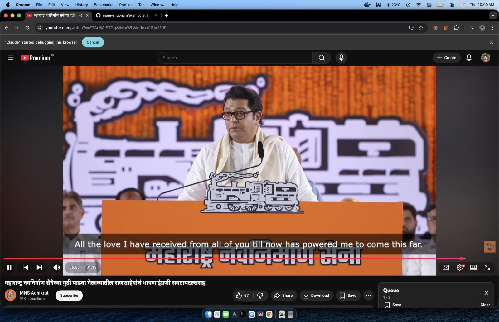

<p align="center">
  
</p>

<h1 align="center">ExamCore</h1>

<h3 align="center">Enterprise-Grade Examination Management System</h3>

<p align="center">
  A complete, production-ready examination platform for educational institutions.
  <br />
  <a href="#-features"><strong>Features</strong></a>
  &nbsp;&middot;&nbsp;
  <a href="#-quick-demo"><strong>Quick Demo</strong></a>
  &nbsp;&middot;&nbsp;
  <a href="#-installation"><strong>Installation</strong></a>
  &nbsp;&middot;&nbsp;
  <a href="#-future-scope"><strong>Roadmap</strong></a>
</p>

<p align="center">
  <a href="https://github.com/more-shubham/examcore/actions/workflows/ci.yml"></a>
  <a href="https://github.com/more-shubham/examcore/pkgs/container/examcore"></a>
  
  
  
  
  
</p>

<br />

<p align="center">
  
</p>

---

## 🚀 Quick Demo

Get ExamCore running locally in under 2 minutes:

```bash
# Clone and start
git clone https://github.com/more-shubham/examcore.git
cd examcore
docker-compose up -d

# Access the application
open http://localhost:8000
```

**Demo Credentials** (after seeding):
| Role | Email | Password |
|------|-------|----------|
| Admin | admin@modelpolytechnic.edu.in | Admin@123 |
| Examiner | examiner@modelpolytechnic.edu.in | Examiner@123 |
| Teacher | dbms.teacher@modelpolytechnic.edu.in | Teacher@123 |
| Student | rahul.patil@modelpolytechnic.edu.in | Student@123 |

> **Note:** Run `python manage.py seed_cypress` to populate demo data.

---

## 📋 Overview

**ExamCore** is an enterprise-grade, open-source examination management system built with Django 5.0. It provides a complete solution for educational institutions to create, manage, and conduct online examinations with built-in anti-cheat features, role-based access control, and instant result generation.

### Why ExamCore?

| Feature | Description |
|---------|-------------|
| 🔓 **Open Source** | Free to use, modify, and distribute under MIT license |
| 🏠 **Self-Hosted** | Full control over your data and infrastructure |
| ⚡ **Modern Stack** | Django 5.0, Tailwind CSS, PostgreSQL |
| 📈 **Scalable** | Designed to handle institutions of any size |
| ✅ **Tested** | 304 E2E tests with Cypress |
| 🐳 **Containerized** | Ready-to-deploy Docker images |

---

## ✨ Features

<table>
<tr>
<td width="50%">

### Question Bank Management
Create, organize, and reuse questions across multiple exams. Support for multiple question types with rich text formatting.

- Multiple choice questions (MCQ)
- Categorize by subject and difficulty
- Import/Export questions
- Question versioning

</td>
<td width="50%">

### Anti-Cheat Protection
Built-in measures to ensure exam integrity and prevent cheating.

- Randomized question order per student
- Randomized option order for MCQs
- Time-limited exam sessions
- Single device enforcement

</td>
</tr>
<tr>
<td width="50%">

### Role-Based Access Control
Separate dashboards and permissions for different user types.

- **Admin** - Full system control
- **Examiner** - Create and manage exams
- **Teacher** - Manage questions and view results
- **Student** - Take exams and view scores

</td>
<td width="50%">

### Instant Results & Analytics
Automatic grading with detailed performance insights.

- Real-time score calculation
- Performance analytics
- Question-wise analysis
- Exportable reports

</td>
</tr>
</table>

---

## Tech Stack

| Category | Technology |
|----------|------------|
| **Backend** | Django 5.0, Python 3.11+ |
| **Database** | PostgreSQL |
| **Frontend** | Tailwind CSS, Alpine.js |
| **Authentication** | Django Auth + OTP Verification |
| **Task Queue** | Celery (optional) |
| **Deployment** | Docker, Gunicorn, Nginx |

---

## Installation

### Prerequisites

- Docker & Docker Compose
- Domain name with SSL certificate
- SMTP service for email verification

### Quick Start

```bash
# Clone the repository
git clone https://github.com/more-shubham/examcore.git
cd examcore

# Copy and configure environment
cp .env.example .env
# Edit .env with your configuration (see DEPLOYMENT.md)

# Set up nginx configuration (see DEPLOYMENT.md)
mkdir -p nginx/ssl
# Add your nginx.conf and SSL certificates

# Start services
docker compose up -d

# Access the application
open https://yourdomain.com
```

For detailed deployment instructions, see [DEPLOYMENT.md](DEPLOYMENT.md).

---

## Project Structure

```
examcore/
├── apps/                    # Django applications
│   ├── academic/           # Classes and subjects management
│   ├── attempts/           # Student exam attempts
│   ├── auth/               # Authentication (login, register, OTP)
│   ├── core/               # Core utilities and base models
│   ├── dashboards/         # Role-based dashboards
│   ├── exams/              # Exam management
│   ├── institution/        # Institution settings
│   ├── invitations/        # User invitations
│   ├── questions/          # Question bank
│   └── users/              # User management
├── config/                  # Project configuration
│   ├── settings/           # Environment-specific settings
│   ├── urls.py             # URL routing
│   └── wsgi.py             # WSGI entry point
├── static/                  # Static files (CSS, JS, images)
├── templates/               # HTML templates
├── media/                   # User uploads
└── manage.py               # Django management script
```

---

## Configuration

All configuration is done through environment variables. See `.env.example` for the complete list.

For detailed configuration instructions, see [DEPLOYMENT.md](DEPLOYMENT.md).

---

## Usage

### First-Time Setup

1. **Register as Admin** - The first user to register becomes the institution admin
2. **Verify Email** - Enter the OTP sent to your email
3. **Set Up Institution** - Configure your institution name and details
4. **Access Dashboard** - Start managing your examination system

### Creating an Exam

1. Navigate to **Questions** to create your question bank
2. Go to **Exams** and click **Create Exam**
3. Add questions from your question bank
4. Set duration, passing score, and availability window
5. Assign to classes/students
6. Publish the exam

### Student Flow

1. Students receive invitation email
2. Register and verify account
3. Access **My Exams** from dashboard
4. Take available exams
5. View results immediately after submission

---

## API Documentation

ExamCore provides a RESTful API for integration with other systems.

```bash
# API endpoints (coming soon)
GET  /api/v1/exams/          # List all exams
POST /api/v1/exams/          # Create new exam
GET  /api/v1/questions/      # List questions
POST /api/v1/attempts/       # Submit exam attempt
```

---

## Contributing

We welcome contributions! Please see our [Contributing Guide](CONTRIBUTING.md) for details.

For development setup and code style guidelines, refer to [CLAUDE.md](CLAUDE.md).

---

## Future Scope

### Phase 2: Enhanced Question Types
- [ ] Fill-in-the-blank questions
- [ ] Essay/long answer with manual grading
- [ ] Matching questions
- [ ] True/False questions
- [ ] Image-based questions

### Phase 3: Advanced Features
- [ ] REST API for third-party integrations
- [ ] Proctoring integration (webcam monitoring)
- [ ] Browser lockdown mode
- [ ] Plagiarism detection for essays
- [ ] Question difficulty auto-adjustment

### Phase 4: Analytics & Reporting
- [ ] Advanced analytics dashboard
- [ ] Performance trend analysis
- [ ] Question effectiveness metrics
- [ ] Exportable PDF reports
- [ ] Comparative class analysis

### Phase 5: Platform Expansion
- [ ] Mobile application (iOS/Android)
- [ ] Multi-language support (i18n)
- [ ] LTI integration for LMS (Moodle, Canvas)
- [ ] Bulk import/export (CSV, Excel)
- [ ] White-label customization

### Phase 6: Enterprise Features
- [ ] Multi-institution support
- [ ] SSO integration (SAML, OAuth)
- [ ] Role-based API access
- [ ] Audit logging
- [ ] Custom branding per institution

---

## Security

If you discover a security vulnerability, please send an email to security@example.com instead of using the issue tracker.

---

## License

This project is licensed under the MIT License - see the [LICENSE](LICENSE) file for details.

---

## Support

- **Documentation**: [docs.examcore.dev](https://docs.examcore.dev)
- **Issues**: [GitHub Issues](https://github.com/more-shubham/examcore/issues)
- **Discussions**: [GitHub Discussions](https://github.com/more-shubham/examcore/discussions)

---

<p align="center">
  <sub>Built with Django and lots of coffee</sub>
</p>

<p align="center">
  <a href="https://github.com/more-shubham/examcore">
    
  </a>
</p>
